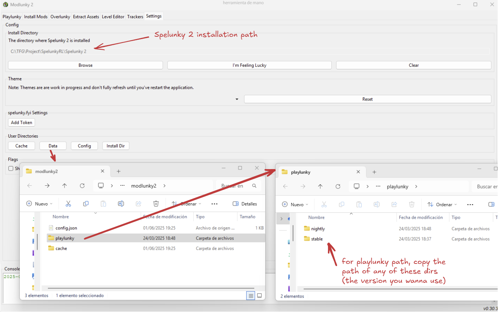

# Getting Started with SpelunkyRL

This guide will walk you through installing and running your first SpelunkyRL environment.

## Prerequisites

### Required Software

1. **Spelunky 2** - The base game must be installed
2. **Python 3.8+** - For running the RL environment
3. **Windows 11** - Required for full functionality (older versions may work but render mode might have issues)

### Required Tools

Before installing SpelunkyRL, you must set up the Spelunky 2 modding infrastructure:

1. **[modlunky2](https://github.com/spelunky-fyi/modlunky2)** - Essential mod management tool
   - Follow the installation instructions in their repository
   - **Important**: Do not use modding tools with your Steam installation. Create a separate copy of Spelunky 2 for modding.

2. **[Playlunky](https://github.com/spelunky-fyi/Playlunky)** - Enables mod loading and script injection
   - Usually installed automatically by modlunky2

## Installation

### Step 1: Find Your Paths

You'll need two important paths. To find them:

1. Open modlunky2
2. Go to Settings
3. Note the **Spelunky 2 installation directory** (where `Spel2.exe` is located)
4. Click **User Directories** → **Data**
5. In the file explorer that opens, navigate to the `playlunky` folder
6. Copy the path to any Playlunky version folder (e.g., `playlunky/nightly`)



### Step 2: Clone the Repository

Clone SpelunkyRL into your Spelunky 2 Mods folder:

```bash
cd "C:\Path\To\Your\Spelunky 2\Mods\Packs"
git clone https://github.com/your-repo/spelunkyRL.git
```

### Step 3: Create Virtual Environment

It's recommended to use a virtual environment (can be anywhere on your system):

```bash
# Create virtual environment
python -m venv spelunky_env

# Activate it (Windows)
spelunky_env\Scripts\activate
```

### Step 4: Install SpelunkyRL

```bash
# If working in the cloned repo directory
pip install .

# If working from a different location
pip install "C:\Path\To\Your\Spelunky 2\Mods\Packs\spelunkyRL"
```

## Your First Environment

Here's a minimal example to verify everything is working:

```python
from spelunkyRL.environments.dummy_environment import SpelunkyEnv

# Create the environment
env = SpelunkyEnv(
    spelunky_dir=r"C:\Path\To\Spelunky 2",  # Path to Spel2.exe
    playlunky_dir=r"C:\Users\YourName\AppData\Local\spelunky.fyi\modlunky2\playlunky\nightly"
)

# Reset the environment
obs, info = env.reset()

# Take 100 random steps
for _ in range(100):
    action = env.action_space.sample()
    obs, reward, done, truncated, info = env.step(action)

    if done or truncated:
        obs, info = env.reset()

# Clean up
env.close()
```

## Environment Configuration

The `SpelunkyRLEngine` (base class for all environments) accepts several configuration parameters:

### Basic Parameters

```python
env = SpelunkyEnv(
    spelunky_dir=r"C:\Path\To\Spelunky 2",     # Required: Path to Spel2.exe
    playlunky_dir=r"C:\Path\To\playlunky",     # Required: Path to playlunky_launcher.exe
    frames_per_step=6,                          # Optional: Game frames per RL step (default: 6)
    render_enabled=False,                       # Optional: Enable render() method (default: False)
    console=False,                              # Optional: Show Spelunky console (default: False)
)
```

### Reset Options

You can configure game settings via `reset()` or by passing them to `__init__()` as kwargs:

```python
# Option 1: Configure at initialization
env = SpelunkyEnv(
    spelunky_dir=r"C:\Path\To\Spelunky 2",
    playlunky_dir=r"C:\Path\To\playlunky",
    hp=8,           # Start with 8 HP
    bombs=10,       # Start with 10 bombs
    world=2,        # Start in world 2
)

# Option 2: Configure at reset
obs, info = env.reset(
    seed=42,        # Set random seed
    hp=4,           # Start with 4 HP
    god_mode=True,  # Enable invulnerability
)
```

### Available Reset Options

| Parameter | Type | Default | Description |
|-----------|------|---------|-------------|
| `seed` | int | Random | Random seed for level generation |
| `speedup` | bool | False | Allow game to run faster than 60 FPS |
| `state_updates` | int | 0 | Engine updates without rendering (speeds up training, 100-300 typical) |
| `manual_control` | bool | False | Enable keyboard control (useful for testing) |
| `god_mode` | bool | False | Player invulnerability |
| `hp` | int | 4 | Starting health |
| `bombs` | int | 4 | Starting bombs |
| `ropes` | int | 4 | Starting ropes |
| `gold` | int | 0 | Starting gold |
| `world` | int | 1 | Starting world (1-16, see [THEME](https://spelunky-fyi.github.io/overlunky/#THEME)) |
| `level` | int | 1 | Starting level within world |
| `ent_types_to_destroy` | list | [] | Entity type IDs to remove at level start |

## Performance Optimization

For training, you'll want to maximize speed:

```python
env = SpelunkyEnv(
    spelunky_dir=r"C:\Path\To\Spelunky 2",
    playlunky_dir=r"C:\Path\To\playlunky",

    # Speed optimizations
    speedup=True,           # Run faster than real-time
    state_updates=200,      # Skip rendering frequently (test different values)
    render_enabled=False,   # Don't capture frames

    # Training settings
    frames_per_step=6,      # Balance between reactivity and speed
)
```

**Note**: `state_updates` can dramatically increase speed but may crash if set too high. Start with 100-200 and increase gradually. Do not use `state_updates` when `render_enabled=True`.

## Manual Control (Testing)

To test your environment with keyboard controls:

```python
env = SpelunkyEnv(
    spelunky_dir=r"C:\Path\To\Spelunky 2",
    playlunky_dir=r"C:\Path\To\playlunky",
    manual_control=True,    # Enable keyboard input
    god_mode=True,          # Useful for testing
    console=True,           # Show console for debugging
)

obs, info = env.reset()

# Game loop - keyboard controls are active
while True:
    # Action doesn't matter in manual_control mode
    obs, reward, done, truncated, info = env.step(env.action_space.sample())

    if done or truncated:
        obs, info = env.reset()
```

Controls:
- Arrow keys: Movement
- Z: Jump
- X: Whip/Attack
- C: Bomb
- V: Rope
- Shift: Run
- Up Arrow (at door): Enter door

See `spelunkyRL/examples/manual_control.py` for a complete example.

## Example Scripts

SpelunkyRL includes several example scripts in `spelunkyRL/examples/`:

- **`manual_control.py`** - Test environment with keyboard controls
- **`train_get_to_exit.py`** - Complete training example with RecurrentPPO
- **`evaluate_model.py`** - Evaluate a trained model
- **`record_video.py`** - Record video of agent gameplay

## Logging

SpelunkyRL can log game state information for debugging:

```python
env = SpelunkyEnv(
    spelunky_dir=r"C:\Path\To\Spelunky 2",
    playlunky_dir=r"C:\Path\To\playlunky",
    log_file="game_log.txt",        # Where to save logs
    log_info=["all", "map_info"],   # What to log
)
```

Available log options:
- `"all"` - Full JSON gamestate with timestamp
- `"map_info"` - Formatted 11x21 terrain grid
- `"entity_count"` - Count of each entity type visible

## Next Steps

- **[Environments Guide](environments.md)** - Learn about available environments and create your own
- **[Architecture Guide](architecture.md)** - Understand how SpelunkyRL works internally
- **Example Scripts** - Check `spelunkyRL/examples/` for training and evaluation examples

## Troubleshooting

**Environment won't start:**
- Verify paths to `Spel2.exe` and `playlunky_launcher.exe` are correct
- Make sure modlunky2 is properly configured
- Check that `load_order.txt` exists in your Spelunky 2 Mods folder

**Game is too slow:**
- Set `speedup=True`
- Increase `state_updates` (start with 100, increase gradually)
- Decrease `frames_per_step` (but this affects agent reactivity)

**Game crashes with high state_updates:**
- Lower the value - the maximum depends on what data you're requesting
- Different environments can handle different values
- Start conservative (100-200) and increase gradually

**Import errors:**
- Make sure you've installed the package: `pip install .`
- Check that your virtual environment is activated
- Verify all dependencies installed correctly
