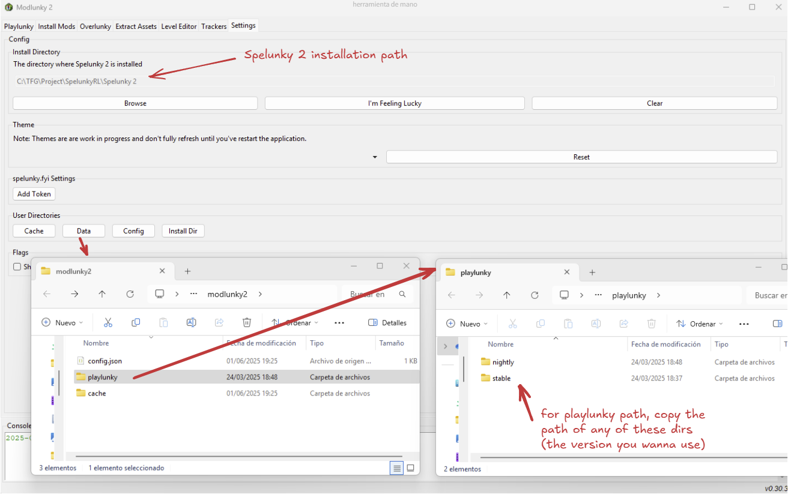

SpelunkyRL is a Reinforcement Learning environment, designed to provide a standard RL interface to Spelunky 2. It comes with predefined tasks but also a high degree of customability, to allow for a wide variety of experimentation.

This project is built using 
[Playlunky](https://github.com/spelunky-fyi/Playlunky),
[modlunky2](https://github.com/spelunky-fyi/modlunky2) and
[overlunky](https://github.com/spelunky-fyi/overlunky).
Some information will reference these, specially the latter one, when talking about identifiers and enumerations.

# 🚀 Getting Started

This project uses [Gymnasium](https://github.com/Farama-Foundation/Gymnasium), which provides a standardized interface for RL environments. If you're familiar with it, using SpelunkyRL should be extremely simple.

## 🛠️ Installation
To use this project, you require an installation of Spelunky 2 on your computer. It also requires `python>=3.8` and `Windows 11` (probably works with older version, but some features like "render" might give problems).
The first step you should do is install
[modlunky2](https://github.com/spelunky-fyi/modlunky2), following the instructions. As already explained there, it's not recommended using modding tools with your actual Steam installation.

Once you've completed the first step, clone this repo into `..\Spelunky 2\Mods\Packs\`, being `..` your Spelunky 2 installation path.
Then, create a virtual environment where you want to work (it can be that same folder if you prefer, but having virtual environments on the mods folder can slow the launch process). Finally, install the library using:
```bash
# If working in the same directory as the cloned repo
pip install .

# If working from a different location, provide the full path to the repo
pip install "C:\Path\To\Your\Spelunky 2\Mods\Packs\spelunkyRL"
```
After that, you're all set to start using SpelunkyRL!

## 💡 Basic Usage

To use any of the default environments, simply import it on your script this way. You should have the path to your Spelunky 2 game and to your playlunky installation. Both can be obtained executing modlunky and going to the settings window. The first one will appear right there, and for the second one you should click "User Directories" -> "Data". That will open a file explorer, enter the "playlunky" dir and there will be all the playlunky vesions. Copy the path to any of them.



```python
from spelunkyRL.environments.dummy_environment import SpelunkyEnv

env = SpelunkyEnv(
    spelunky_dir= # path to the dir where Spel2.exe is
    playlunky_dir= # path to the dir where playlunky_launcher.exe is
)

env.reset()
env.step(...)
```

## 📘 Environment Interface & Method Documentation

Here are the methods in the environment, defined in [`core.py`](./spelunkyRL/engine/core.py). Methods include their parameters, which specify use, type and default values(if there is no default value specified, it means it is mandatory):

- __init__()
    - spelunky_dir (string): path to Spel2.exe
    - playlunky_dir (string): path to playlunky_launcher.exe
    - frames_per_step (int, 6): how many frames to play internally (used for frameskipping).
    - render_enabled (bool, False): use True to enable the render() function
    - console (bool, False): whether or not to mantain Spelunky's console. Useful to debug LUA code.
    - log_file (str, None): where to save the logs. If none, it's not saved.
    - log_info (list[str], ["all"]): which parts of information to log. Possible values are "all" (writes the JSON directly received from LUA), "map_info" (writes a 21x11 grid with the id of each tile, correctly formatted) and "entity_count" (prints the quantity of each entity type seeable by the character).
    - **kwargs: all info received as kwargs is saved as "reset_options", which will be seen later on the reset() method.

- reset(): initializes the environment and returns the initial observation. If not set, will use the ones saved as "reset_options". If neither are set, will use default values.
    - seed (int, None): seed to be used.
    - speedup (bool, False): whether or not to allow the game running faster than 60 FPS.
    - state_updates (int, 0): allows updating the game engine without without running some parts of the game, such as rendering. High values can increase dramatically the number of steps per second, but a very high number can end up crashing the game(depending on the information passed, that's why the number is not fixed). Tipical values can arrive at 100-300. Do not use when utilizing the "render()" function.
    - ent_types_to_destroy (array, []): array of types ids to destroy at the start of the level.
    - manual_control (bool, False): if True, ignores commands received by the Python agent and allows the user to control the game. Useful for debugging or testing specific scenarios.
    - god_mode (bool, False): whether or not to use god mode, which makes the player invulnerable.
    - hp (int, 4): starting hp.
    - bombs (int, 4): starting bombs.
    - ropes (int, 4): starting ropes.
    - gold (int, 0): starting gold.
    - world (int, 1): from 1 to 16, which world to play. See https://spelunky-fyi.github.io/overlunky/#THEME.
    - level (int, 1): which level number within the world to play.

- step(): applies an action, returns (observation, reward, terminated, truncated, info).
    - action: must match the environment’s action space

- close(): closes the environment, including the game executable.

- render(): renders the current environment state.
    - render_mode (str, "rgb_array"): specifies specifies the format of the rendered output (can only be rgb_array for now)

Here are the properties of the environments. Must be defined by the SpelunkyRLEngine subclasses. Examples at [environments](./spelunkyRL/environments).

- observation_space: must be a valid instance of a [gymnasium.spaces](https://gymnasium.farama.org/api/spaces/).

- action_space: must be a valid instance of a [gymnasium.spaces](https://gymnasium.farama.org/api/spaces/). If not set, uses the default one defined on [`core.py`](./spelunkyRL/engine/core.py). If set, must also define "action_to_input()".

- action_to_input(action): must transform the action received on step (which will match the action_space) into an array that accepts values from 0 to [2,2,1,1,1,1,1,1] (matches the default action_space).

- data_to_send(): receives an array that can contain this values ["map_info", "dist_to_goal", "entity_info"]. Specifies which info will be received from the LUA script, avoiding unnecessary calculations for those fields not needed.

- reset_options(): allows to define the reset options, seen on the reset() method.

- reward_function(gamestate, last_gamestate, action, info): defines how the reward is calculated for each step. It takes the current and previous game states (which is the information received directly from the LUA code), the action taken. Info is the returned dict by default from the gymnasium library (e.g. can be used to track the success rate).

- gamestate_to_observation(gamestate): converts the gamestate directly received from the LUA code to the observation space previously defined.


## 🧪 Customize your Environment

You can customize some of the preexisting environments or create one from zero. For exaple, if you wanted to modify get_to_exit's reward function:

```python
from spelunkyRL.environments.get_to_exit import SpelunkyEnv

class CustomSpelunkyEnv(SpelunkyEnv):
    def reward_function(self, gamestate, last_gamestate, action, info):
        ...

env = CustomSpelunkyEnv(...)
```